# Docker - Exercice Pratique

## 1. Vérifier la version de Docker

**Commande :**

```bash
docker --version
```

**Résultat :**

```
Docker version 29.1.2, build 890dcca
```

**Capture d'écran :**
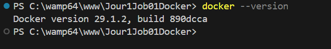


## 2. Afficher les informations système Docker

**Commande :**

```bash
docker info
```

**Résultat :**
Cette commande affiche toutes les informations détaillées sur l'installation Docker : version du serveur, nombre de conteneurs, images, plugins installés, driver de stockage, etc.

**Capture d'écran :**


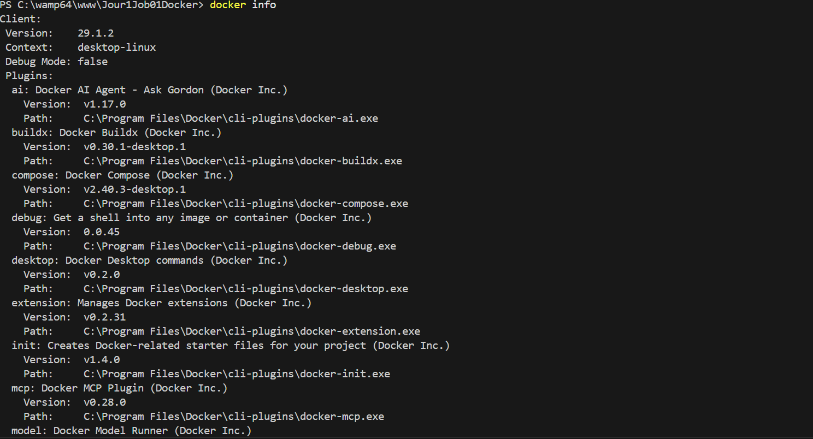

## 3. Lister les conteneurs actifs

**Commande :**

```bash
docker ps
```

**Résultat :**
Cette commande affiche la liste des conteneurs Docker en cours d'exécution. Actuellement, aucun conteneur n'est actif (liste vide).

**Capture d'écran :**


## 4. Lister les images Docker locales

**Commande :**

```bash
docker images
```

**Résultat :**
Cette commande affiche toutes les images Docker téléchargées et disponibles localement. Actuellement, aucune image n'est présente (liste vide).

**Capture d'écran :**

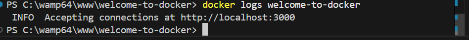
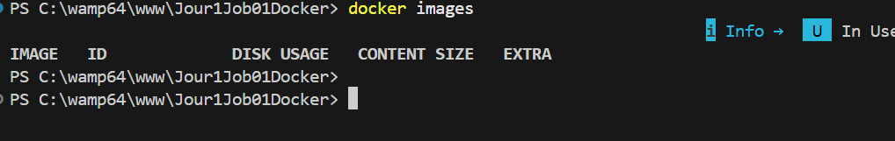

## 5. Tester la commande docker run

**Commande :**

```bash
docker run --help
```

**Résultat :**
Cette commande affiche l'aide et toutes les options disponibles pour créer et lancer un conteneur Docker à partir d'une image.

**Capture d'écran :**

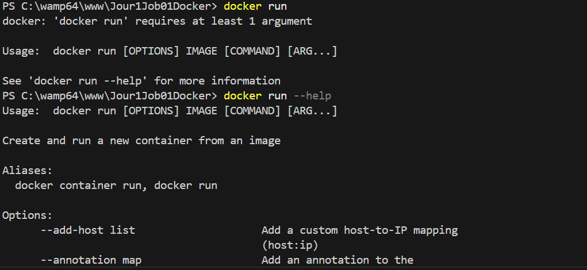


## 6. Tester la commande docker stop

**Commande :**

```bash
docker stop --help
```

**Résultat :**
Cette commande affiche l'aide pour arrêter un ou plusieurs conteneurs en cours d'exécution.

**Capture d'écran :**

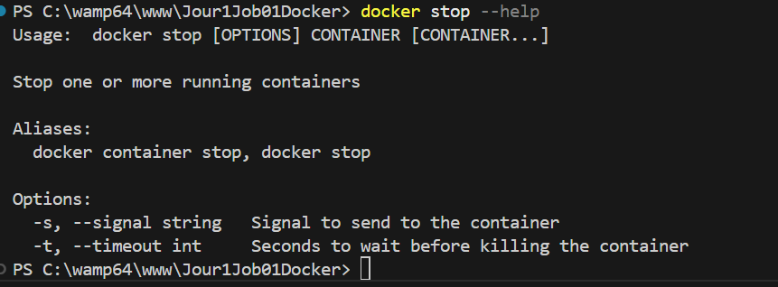


## 7. Récupérer une image Docker

**Commande :**

```bash
docker pull nginx
```

**Résultat :**
L'image nginx a été téléchargée avec succès depuis Docker Hub. L'image est maintenant stockée localement et peut être utilisée pour créer des conteneurs.

**Capture d'écran :**

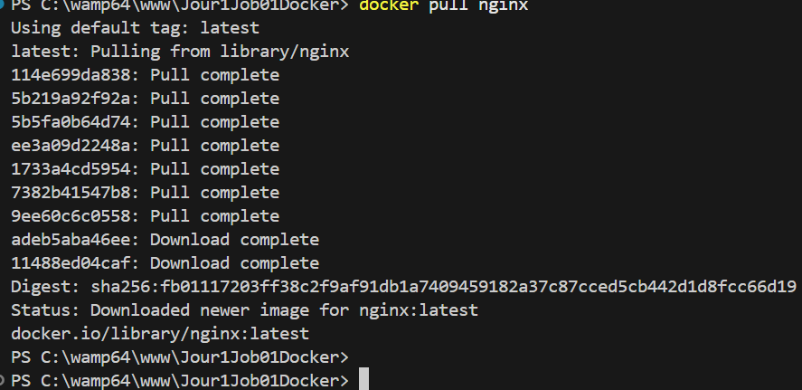


## 8. Vérifier l'image téléchargée

**Commande :**

```bash
docker images
```

**Résultat :**
Affiche la liste des images Docker locales. L'image nginx:latest est maintenant présente avec son ID (fb01117203ff) et sa taille (228MB).

**Capture d'écran :**

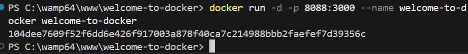


## 9. Construire et lancer le conteneur Docker

**Commande :**

```bash
docker run -it --rm -p 8080:80 nginx
```

**Explication :**

- `-it` : Mode interactif avec terminal
- `--rm` : Supprime le conteneur automatiquement après arrêt
- `-p 8080:80` : Mappe le port 8080 de la machine au port 80 du conteneur
- `nginx` : L'image à utiliser

**Accès au conteneur :** Ouvrez un navigateur et allez à `http://localhost:8080`

**Capture d'écran du terminal :**


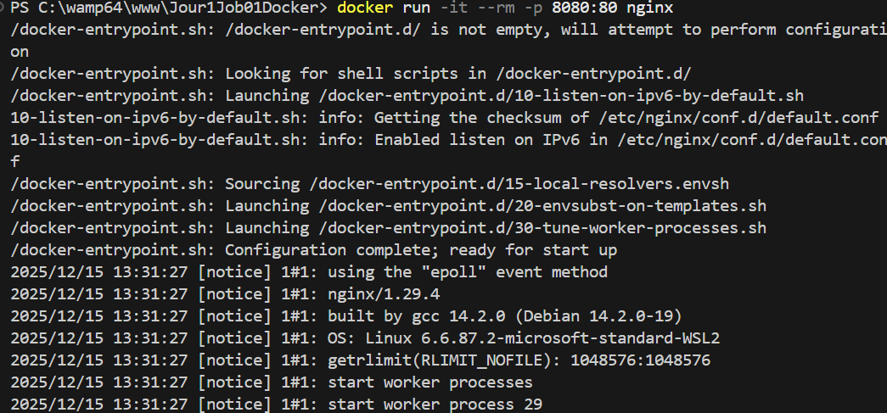

**Capture d'écran du navigateur :**


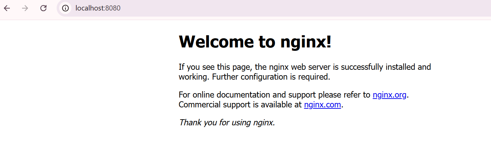

## 10. Lister tous les conteneurs (actifs et arrêtés)

**Commande :**

```bash
docker ps -a
```

**Résultat :**
Affiche tous les conteneurs, qu'ils soient en cours d'exécution ou arrêtés. Avec l'option `--rm` utilisée précédemment, le conteneur a été automatiquement supprimé.

**Capture d'écran :**


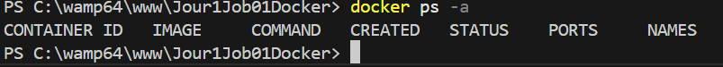

## 11. Supprimer un conteneur

**Commande :**

```bash
docker rm --help
```

**Options principales :**

- `-f` : Forcer la suppression d'un conteneur actif
- `-v` : Supprimer aussi les volumes associés

**Capture d'écran :**

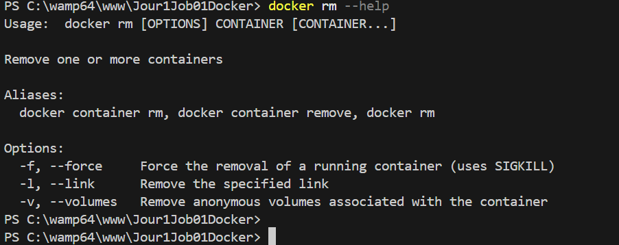


## 12. Supprimer une image Docker

**Commande :**

```bash
docker rmi --help
```

**Options principales :**

- `-f` : Forcer la suppression d'une image

**Capture d'écran :**

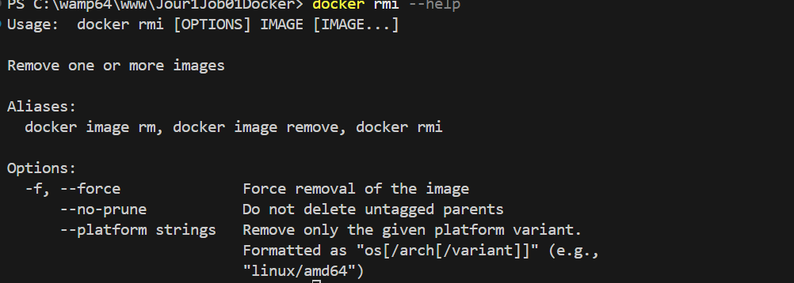

---

## Commandes de suppression - Exemples pratiques

### 13. Supprimer un conteneur spécifique

**Commande :**

```bash
docker rm CONTAINER_ID
```

ou avec le nom :

```bash
docker rm NOM_CONTENEUR
```

### 14. Supprimer plusieurs conteneurs

**Commande :**

```bash
docker rm CONTAINER_ID_1 CONTAINER_ID_2 CONTAINER_ID_3
```

### 15. Supprimer tous les conteneurs arrêtés

**Commande :**

```bash
docker container prune
```

### 16. Forcer la suppression d'un conteneur actif

**Commande :**

```bash
docker rm -f CONTAINER_ID
```

### 17. Supprimer une image spécifique

**Commande :**

```bash
docker rmi IMAGE_ID
```

ou avec le nom :

```bash
docker rmi nginx:latest
```

### 18. Supprimer plusieurs images

**Commande :**

```bash
docker rmi IMAGE_ID_1 IMAGE_ID_2 IMAGE_ID_3
```

### 19. Supprimer toutes les images inutilisées

**Commande :**

```bash
docker image prune
```

### 20. Supprimer toutes les images non utilisées (y compris celles en suspension)

**Commande :**

```bash
docker image prune -a
```

### 21. Forcer la suppression d'une image

**Commande :**

```bash
docker rmi -f IMAGE_ID
```

### 22. Erreur courante et correction

**Erreur fréquente :**
Essayer de supprimer une image alors qu'un conteneur l'utilise encore.

**Message d'erreur :**

```
Error response from daemon: conflict: unable to remove repository reference
```

**Correction :**
Supprimez d'abord le conteneur qui utilise l'image :

```bash
docker rm CONTAINER_ID
docker rmi IMAGE_ID
```

ou directement :

```bash
docker rmi -f IMAGE_ID
```
